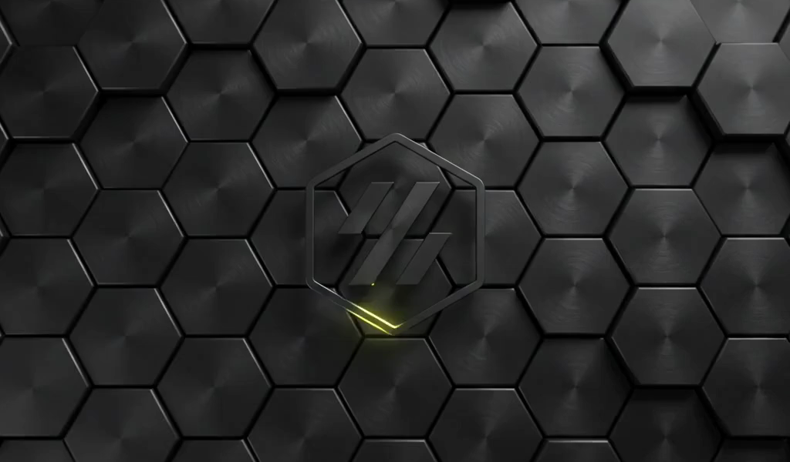

# Voron boot splash (using plymouth)

https://github.com/tehmaze/voron-bootsplash/raw/refs/heads/main/bootsplash.mp4

Prerequisite: tested on a Raspberry Pi 4B and 5 using Debian Trixie

## Installation

Upload the appropriate folder to your Pi as `/usr/share/plymouth/themes/voron`

### 480 x 320 screens (3:2 aspect ratio)


Compatible displays:
* Mellow FLY TFT35 V2 (SPI) ([affliate link](https://s.click.aliexpress.com/e/_c4bXvqp5))

Use the [./voron-480x320](voron-480x320) folder.

### 800 x 480 screens (5:3 aspect ratio)


Compatible displays:
* BigTreeTech PiTFT50 V2.0 ([affiliate link](https://s.click.aliexpress.com/e/_c4parXxd))
* BigTreeTech PiTFT70 ([affiliate link](https://s.click.aliexpress.com/e/_c4parXxd))
* BigTreeTech HDMI5 ([affiliate link](https://s.click.aliexpress.com/e/_c3dkF49H))
* Mellow FLY LCD43 (DSI / HDMI) ([affiliate link](https://s.click.aliexpress.com/e/_c3fTJnnN))
* Mellow FLY LCD50 / LCD5 (DSI / HDMI) ([affliate link](https://s.click.aliexpress.com/e/_c4bXvqp5))
* Mellow FLY LCD70 (DSI / HDMI) ([affliate link](https://s.click.aliexpress.com/e/_c4bXvqp5))
* Waveshare 4.3" DSI
* Waveshare 5" DSI

Use the [./voron-800x480](voron-800x480) folder.

### 1024 x 600 screens (17:10 / 128:75 aspect ratio)



Compatible displays:
* Mellow FLY HDMI7 IPS ([affiliate link](https://s.click.aliexpress.com/e/_c4EPIflp))
* BigTreeTech HDMI7 ([affiliate link](https://s.click.aliexpress.com/e/_c3dkF49H))
* Waveshare 7" DSI / HDMI

### 1280 x 400 screens (32:9 aspect ratio)


Compatible displays:
* Waveshare 7.9" DSI / HDMI
* Waveshare 11.2" DSI / HDMI

Use the [./voron-32-9](voron-32-9) folder.

## Update plymouth

After copying the correct theme folder, update plymouth and reboot:

```console
$ sudo plymouth-set-default-theme --rebuild-initrd voron
update-initramfs: Generating /boot/initrd.img-6.18.34+rpt-rpi-v8
'/boot/initrd.img-6.18.34+rpt-rpi-v8' -> '/boot/firmware/initramfs8'
update-initramfs: Generating /boot/initrd.img-6.18.34+rpt-rpi-2712
'/boot/initrd.img-6.18.34+rpt-rpi-2712' -> '/boot/firmware/initramfs_2712'
$ sudo reboot
```

